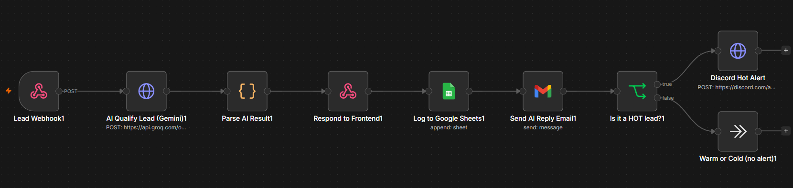

# ⚡ AI Lead Qualifier — Full-Stack Automation System

**Live demo:** [lead-qualifier-frontend.vercel.app](https://lead-qualifier-frontend.vercel.app) · **Response time:** ~3 seconds from form submission to AI-qualified lead

An end-to-end lead qualification system that answers every inquiry in seconds, scores it with AI, and alerts the business owner only when a lead is worth interrupting their day for. Built with **n8n**, **Next.js**, and **Groq (Llama 3.3 70B)** — running 24/7 at **$0/month infrastructure cost**.

> 💡 **Try it:** submit the form on the live demo with a message like *"We need automation for our sales team, budget is $2000"* — then watch the pipeline visualizer run the real workflow behind it.

---

## The Problem

Small businesses lose deals every day for two reasons:

1. **Slow response.** Leads that wait hours for a reply go cold or go to a competitor.
2. **Noise.** Owners waste time reading spam, vendor pitches, and job applications mixed in with real buyers.

## The Solution

Every form submission triggers an automated pipeline that:

| Step | What happens | Time |
|------|-------------|------|
| 🤖 **AI Qualification** | Llama 3.3 70B scores the lead **hot / warm / cold** with reasoning | ~1s |
| ✉️ **Instant reply** | A personalized email response, written by AI for that specific message | ~2s |
| 📊 **CRM logging** | Every lead saved to Google Sheets with score + reasoning | ~1s |
| 🔥 **Smart alerting** | **Hot leads only** trigger an instant Discord notification | ~1s |

Cold leads are filtered silently. Warm leads are logged and answered. Hot leads tap the owner on the shoulder.

---

## Architecture

```
                        ┌─────────────────────────────────────────┐
                        │            Oracle Cloud VM               │
  ┌──────────┐          │  ┌───────┐    ┌─────────────────────┐   │
  │ Visitor  │──HTTPS──▶│  │ Caddy │───▶│  n8n workflow engine │   │
  │ (browser)│          │  │ (SSL) │    └──────────┬──────────┘   │
  └────┬─────┘          │  └───────┘               │              │
       │                └───────────────────────── │ ─────────────┘
       ▼                                           ▼
  ┌───────────────┐                    ┌───────────────────────┐
  │    Vercel     │                    │  Groq API (Llama 3.3) │
  │ Next.js front │                    │  Google Sheets · Gmail │
  │ + API proxy   │                    │  Discord webhooks      │
  └───────────────┘                    └───────────────────────┘
```

**Design decisions worth noting:**

- **API route as proxy** — the browser never sees the n8n webhook URL. The Next.js server-side route validates input and forwards it, eliminating CORS issues and hiding infrastructure.
- **Self-hosted n8n behind Caddy** — automatic HTTPS via Let's Encrypt, reverse-proxied so only ports 80/443 are exposed. n8n itself is not reachable directly.
- **Fail-safe AI parsing** — if the LLM returns malformed JSON, the pipeline degrades gracefully: the lead defaults to "warm" and still gets a reply, logged with a parse-failure flag. No lead is ever dropped.
- **Provider-agnostic AI layer** — the AI call is a plain HTTP node; swapping Groq for Gemini/OpenAI is a 2-field change (proven: this project migrated providers mid-build).

---

## Tech Stack

| Layer | Technology | Why |
|-------|-----------|-----|
| Frontend | Next.js 15 (App Router) | Server-side API routes, free Vercel hosting |
| Automation | n8n (self-hosted, Docker) | Visual workflow engine, unlimited executions |
| AI | Groq — Llama 3.3 70B | Sub-second inference, generous free tier |
| Hosting (backend) | Oracle Cloud Always Free VM | 24/7 uptime, $0/month |
| HTTPS / proxy | Caddy + DuckDNS | Auto-renewing SSL, free domain |
| Data & comms | Google Sheets, Gmail, Discord | Tools small businesses already use |

**Total infrastructure cost: $0/month.**

---

## The n8n Workflow



```
Webhook → AI Qualify (Groq) → Parse & Validate → Respond to Frontend
        → Log to Google Sheets → Send AI Reply Email
        → IF hot → Discord Alert
```

Key implementation details:

- **Structured LLM output** — the prompt constrains the model to a strict JSON schema (`score`, `reason`, `reply`) with explicit scoring rules
- **Cross-node data access** — downstream nodes reference qualified lead data via `$('Parse AI Result')` rather than the mutated stream (Gmail's output replaces pipeline data — a real-world n8n gotcha this project handles correctly)
- **Input sanitization** — score normalization (`toLowerCase().trim()`) guards the branching logic against LLM formatting drift

---

## Running It Yourself

<details>
<summary><strong>Frontend (local)</strong></summary>

```bash
git clone https://github.com/YOUR_USERNAME/lead-qualifier-frontend.git
cd lead-qualifier-frontend
npm install
cp .env.local.example .env.local   # add your n8n webhook URL
npm run dev
```
</details>

<details>
<summary><strong>Backend (n8n)</strong></summary>

1. Deploy n8n via Docker Compose (config in `docs/docker-compose.yml`) behind Caddy for HTTPS
2. Import `docs/lead-qualifier-workflow.json` into n8n
3. Add credentials: Groq API key, Google Sheets + Gmail OAuth, Discord webhook URL
4. Activate the workflow and point `N8N_WEBHOOK_URL` at it
</details>

---

## What I Learned Building This

- Deploying and operating a production Linux server (Oracle Cloud, Docker, swap tuning on 1GB RAM, iptables + cloud security lists)
- OAuth 2.0 in practice: consent screens, test users, redirect URI constraints (Google rejects raw IPs — solved with DuckDNS + Caddy SSL)
- Prompt engineering for **reliable structured output** from LLMs, with defensive parsing for when they drift
- n8n data-flow internals: how node outputs replace the pipeline stream, and cross-node references
- Debugging distributed systems layer by layer: browser → Vercel → reverse proxy → n8n → third-party APIs

---

## Roadmap

- [ ] Lead dashboard page (charts of hot/warm/cold ratios over time)
- [ ] Follow-up sequence: auto-reminder if a hot lead isn't contacted within 24h
- [ ] Multi-tenant version: one workflow serving multiple client websites
- [ ] Swap Sheets for Supabase once volume justifies it

---

## About

Built by **Areeba Arif** — automation developer specializing in n8n workflows and AI-powered business process automation.

📫 Open to automation projects and roles: [areebaarif704@gmail.com](mailto:areebaarif704@gmail.com)

*If this project interests you, the best demo is the live one — submit the form and watch it work.*
